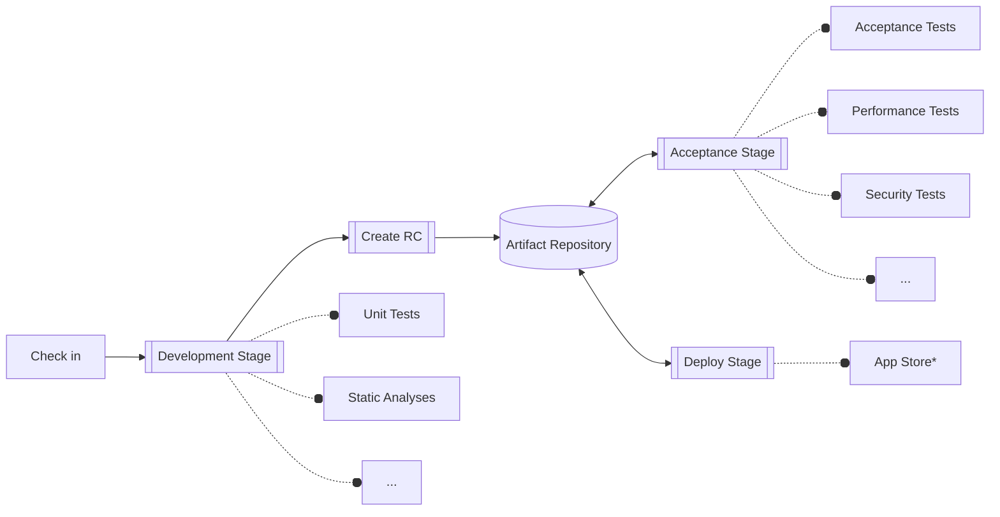

# XCPipeline

> **Disclamer**
>
> This is still a work in progress!<br>
> All content is prone to change!

Continuous delivery pipeline for Xcode projects based on the famous Continuous Delivery Pipeline developed by Dave Farley.

## Outline



### Development Stage considerations

- Triggered on commit (push) to repo
- Checks out the repos code
- Runs fast tests and static analyses
- Aim for <  5 min execution time
- Uploads a RC to the artifact repo (`Pick up area`)
- Tags the commit with the `RC id`

#### Development Stage steps

- Build tor testsing (generic device, any iOS simulator)
- Run tests
- Run swift lint
- Tag
  - find latest tag
  - increase latest tag

### Artifact Repository considerations

- Pick up area
- RC index
  - History of created RCs
  - RC states
  - RC info if RC is deployable
  - RC info if RC was already deployed
  - Contains all necessary info to rebuild a RC

## Utilizing GitHub Actions

### Development Stage

```yaml
name: Development Stage

on:
  push:
    branches: [ "main" ]
  pull_request:
    branches: [ "main" ]

jobs:
  run-stage:
    name: Unit Tests
    runs-on: macos-latest
    steps:
    - name: Checkout code
      uses: actions/checkout@v3
    - name: Run development stage
      run: pipeline development.yml
    - name: Create RC Artifact
      if: success()
      run: pipeline create-rc
    - name: Upload RC Artifact # Upload to pickup station
      if: success()
      run: pipeline artifacts upload-rc artifact_repo.yml
```